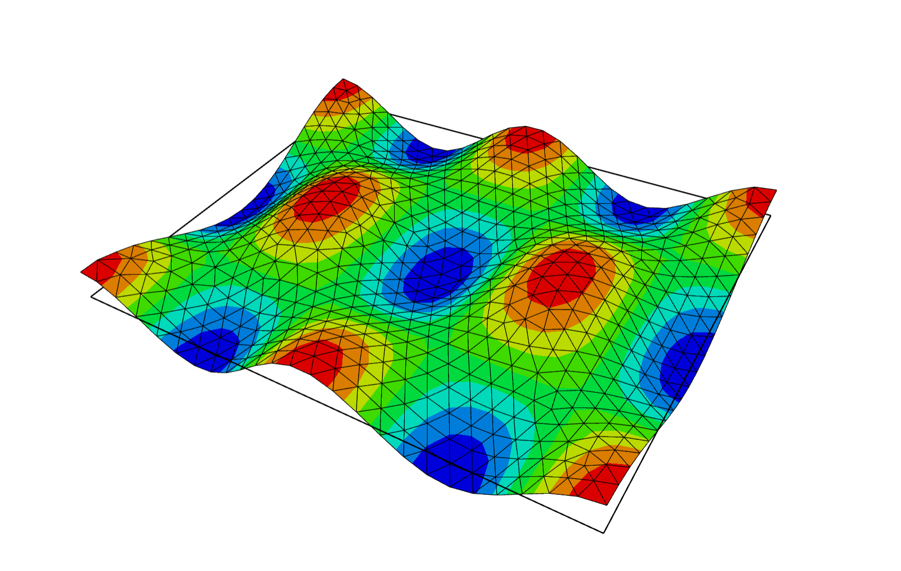

# A Krylov eigenvalue solver in Python

This Python package is designed for numerically solving eigenvalue problems of linear partial differential operators, such as the Laplace operator. It utilizes the finite element method, specifically employing the ``netgen`` and ``ngsolve`` packages (see [here](https://ngsolve.org)), to define domains, boundaries, and discretize the problem.

By applying special filter functions and Krylov iteration to the generated discretization matrices, the package computes the eigenvalues of the operator within a specified region of interest (an interval set by the user), along with the corresponding eigenvectors (eigenfunctions). This approach significantly reduces the size of the matrix eigenvalue problem after discretization, thereby lowering computational costs. Krylov iteration is particularly suitable for large-scale problems with a high number of degrees of freedom.

