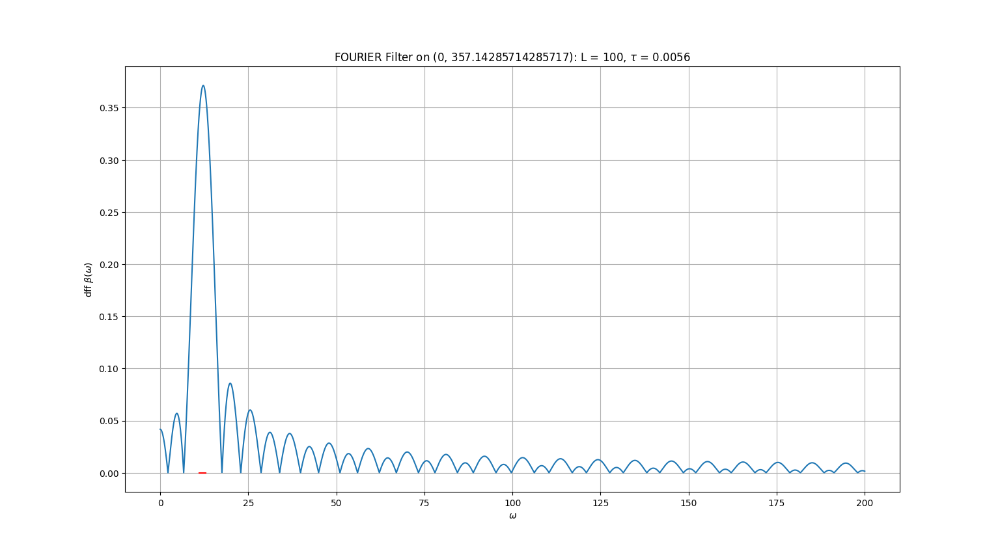
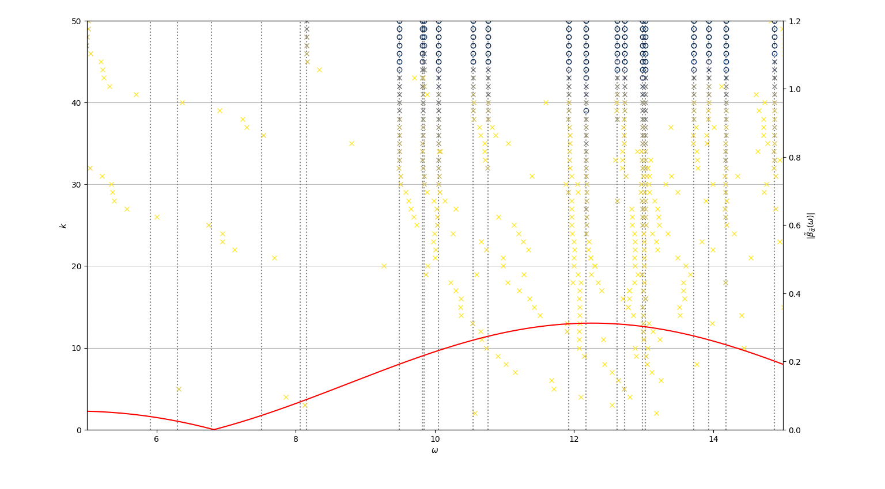

Mathematical background
==========================

Full description of the method including proofs and examples you can find in PDF.

.. _PDF: https://x.com

1. Finite element method
--------------------------

We seek eigenpairs :math:`(\omega^2, u)` (note that we use the notation :math:`\omega^2` for the eigenvalue) of a linear partial derivative operator :math:`L` on a domain :math:`\Omega` with given boundary conditions. This means we aim to find :math:`u` such that :math:`Lu = \omega^2 u`. We begin with the standard Finite Element Method (FEM) approach: defining a mesh, fixing a finite-dimensional solution space of hat functions (or optionally, splines) :math:`V_h`, and reformulating the problem in its weak form.

As an example, we consider the **negative Laplacian eigenvalue problem** with Neumann boundary conditions:

.. math::
	-\Delta u = \omega^2 u \quad \text{ in } \Omega,
.. math::
	\frac{\partial u}{\partial \nu} = 0 \quad\text{ on } \partial\Omega. 

Its weak form is:

.. math::
	\int_\Omega \nabla u \cdot \nabla \varphi \, dx = \omega_h^2 \int_\Omega u \varphi \, dx.
	
Using a fixed basis :math:`\varphi_1, \dots, \varphi_N` of the solutions space :math:`V_h`, we define the discretization matrices :math:`S` and :math:`M` as follows:

.. math::
	s_{ij} := \int_\Omega \nabla \varphi_i \cdot \nabla \varphi_j \, dx \quad \text{ and } \quad m_{ij} := \int_\Omega \varphi_i \varphi_j \, dx.
	
This leads to the discrete matrix eigenvalue problem:

.. math::
	Sv = \omega^2 Mv,

or, equivalently, 
	
.. math::
	M^{-1}Sv = \omega^2 v,
	
where :math:`v` denotes the coordinate vector of the eigenfunction.

2. Filtered time-domain solutions
-----------------------------------

Krylov eigenvalue solver finds eigenvalues within a specified **region of interest**, denoted as :math:`(\omega_\min^2, \omega_\max^2)`. We aim to construct a linear operator :math:`C` that shares the same eigenspaces as :math:`M^{-1}S`, but with different eigenvalues. Crucial to the contruction of the operator :math:`C` is the **weight vector** :math:`\alpha` and induced **discrete filter function** (**dff**) :math:`\beta(\omega)`. 

- If :math:`v` is an eigenvector of :math:`M^{-1}S` corresponding to an eigenvalue :math:`\omega^2 \in (\omega_\min^2, \omega_\max^2)`, then :math:`v` is an eigenvector of :math:`C` corresponding to a large eigenvalue :math:`\beta(\omega)`.
- If :math:`v` is an eigenvector of :math:`M^{-1}S` corresponding to an eigenvalue :math:`\omega^2 \notin (\omega_\min^2, \omega_\max^2)`, then :math:`v` is an eigenvector of :math:`C` corresponding to a close to zero eigenvalue :math:`\beta(\omega)`.

For a detailed description of this operator, see PDF. It is impossible to push values of :math:`\beta` outside the region of interest close to 0, so we control the values of dff withinin a **control interval** denoted as :math:`(0, \omega_{\mathrm{end}}^2)` only. All eigenvalues of :math:`M^{-1}S` should lie in this interval: :math:`(0, \omega_{\mathrm{end}}^2)`. 
 
.. _PDF: https://x.com

In constructing :math:`C`, we perform simple time-stepping with :math:`L` time-steps of size :math:`\tau` to the end-time :math:`T = L\tau`. The **CFL condition** requires, that :math:`\tau \leq 2/\omega_{\mathrm{end}}`. For computational efficiency, we recommend using :math:`\tau \lessapprox 2/\omega_{\mathrm{end}}`. A higher number of time-steps :math:`L` (or larger end-time :math:`L`) increases the reliability of the algorithm and improves the behavior of the dff, but linearly increases computation costs.

3. Krylov iteration
---------------------

To find the eigenpairs of the operator :math:`C`, we use the Krylov iteration method, starting from a random vector. With each iteration step, the algorithm "catches" one eigenpair of :math:`C`, beginning with the largest eigenvalues. increases accuracy of already catched eigenpairs. Simultaneously, it refines the accuracy of the previously computed eigenpairs. Once the eigenvectors of :math:`C` are determined, the eigenvectors of the original problem, :math:`M^{-1}S`, are also known, allowing for the computation of the corresponding eigenvalues, :math:`\omega^2`. 

The properties of the Krylov iteration, along with an appropriate filtering method, ensure that the desired eigenvalues are captured early in the process. This significantly reduces the computational cost compared to other methods.

   
The results of the first 50 steps of the Krylov iteration for the negative Laplacian problem with the region of interest :math:`(\omega_\min, \omega_\max) = (11, 13)`. In the plot, each horizontal level corresponds to one iteration step (:math:`k` denotes the step number). Each point represents a computed value of :math:`\omega`, with its color and marker indicating the accuracy of the approximation. Eigenvalues computed with an accuracy better than :math:10^{-5} are marked with an "o.". The vertical dotted lines represent true eigenvalues of :math:`M^{-1}S` for reference. 

The red line (scaled on the right axis) represents the dff :math:`\beta(\omega)`. Faster convergence is observed in regions where the dff is larger, while little to no convergence occurs in other regions. After 50 iterations, all eigenvalues within the target interval are approximated with an accuracy exceeding :math:`10^{-5}`. A direct approach would require solving a 629-dimensional matrix eigenvalue problem.